# 🌱 Green Movement

GitHub 잔디(Contribution Graph)를 **움직이는 목장**으로 바꿔 주는 프로젝트예요.  
당신의 1년치 기여도가 SVG 애니메이션으로 그려지고, UFO가 양을 내려놓고, 양이 잔디를 먹고, 꽃이 피는 걸 프로필 README에서 볼 수 있습니다.

<p align="center">
  
</p>

---

## 이 프로젝트로 할 수 있는 것

- **GitHub 프로필 README**에 “나의 잔디 → 목장 애니메이션” SVG를 올릴 수 있어요.
- Fork(또는 Template)한 뒤 **GitHub Actions**로 매일 자동 갱신할 수 있어요.
- 로컬에서 한 번만 생성해서 수동으로 올려도 됩니다.

---

## 🚀 프로필 README에 올리는 방법

### 1. 이 저장소 가져오기

- **Fork**: 이 저장소를 본인 계정으로 Fork
- 또는 **Use this template**: “Create a new repository”로 새 저장소 생성

> ⚠️ 가져온 저장소가 **본인 계정(또는 조직) 소유**여야 Actions와 Secrets를 쓸 수 있어요.

---

### 2. 프로필 README 저장소 준비하기

GitHub 프로필에 보이는 README는 **`사용자명/사용자명`** 공개 저장소의 `README.md`입니다.

- 아직 없다면: **New repository** → 이름을 **본인 GitHub 사용자명**으로, Public, README 포함해서 생성하세요.

---

### 3. 토큰(PAT) 만들기

프로필 저장소에 이 프로젝트가 생성한 SVG를 자동으로 푸시하려면 Personal Access Token이 필요해요.

1. GitHub **Settings** → **Developer settings** → **Personal access tokens** → **Tokens (classic)**
2. **Generate new token (classic)**
3. Scopes에서 **repo** 체크
4. 생성 후 나오는 토큰을 **한 번만** 보이니까 반드시 복사해 두세요.

---

### 4. Fork한 green-movement에 Secret 넣기

Fork(또는 Template)한 **green-movement** 저장소에서:

**Settings** → **Secrets and variables** → **Actions** → **New repository secret**

| 이름                   | 값               | 설명                                     |
| ---------------------- | ---------------- | ---------------------------------------- |
| `PROFILE_README_TOKEN` | (방금 만든 토큰) | 프로필 저장소에 푸시할 때 사용. **필수** |

(선택) 다른 사람 잔디를 쓰고 싶다면:

| 이름              | 값                   |
| ----------------- | -------------------- |
| `GITHUB_USERNAME` | 대상 GitHub 사용자명 |

---

### 5. 프로필 README에 이미지 넣기

**프로필 저장소**(`사용자명/사용자명`)의 `README.md`에 아래를 추가하세요.

```md
## 🌱 잔디


```

> 브랜치가 `main`이 아니면 `main` 부분을 해당 브랜치 이름으로 바꿔 주세요.

---

### 6. 첫 SVG 만들기

**방법 A (권장)**  
Fork한 **green-movement** 저장소에서:  
**Actions** → **Update profile README with grass SVG** → **Run workflow**

**방법 B**  
프로필 저장소에 `assets` 폴더를 만들고, 그 안에 빈 파일 `live.svg`를 만들어서 한 번 커밋해 두기.  
그 다음 위 워크플로를 실행하면 그 파일이 실제 SVG로 덮어 써집니다.

---

## ⏰ 자동 갱신

워크플로는 **매일 오후 10시(KST)** 에 실행되어, 프로필 저장소의 `assets/live.svg`를 갱신합니다.

- 시간을 바꾸고 싶다면: `.github/workflows/update-profile-readme.yml`에서 `cron` 값을 수정하세요.

---

## 💻 로컬에서 한 번만 SVG 만들기

Node.js 18 이상이 필요해요.

1. 프로젝트 루트에 `.env` 파일을 만들고:

```bash
GITHUB_TOKEN=ghp_xxxx   # repo 권한 있는 PAT
GITHUB_USERNAME=본인아이디   # 비우면 토큰 소유자 잔디 사용
```

2. 설치 후 실행:

```bash
npm install
npm run generate
```

성공하면 `assets/live.svg`가 생성됩니다. 이 파일을 프로필 저장소의 `assets/live.svg`에 수동으로 올려도 됩니다.

---

## 📁 생성되는 SVG 크기

기본적으로 SVG 가로는 **896px**로 맞춰집니다.  
다른 크기를 쓰고 싶다면 `src/config/constants.ts`의 `README_TARGET_WIDTH`를 수정하거나, 코드에서 `renderGridSvg(grid, { targetWidth: 700 })`처럼 옵션으로 넘기면 됩니다.

---

## 📄 라이선스

이 프로젝트는 원저작자 표기와 함께 자유롭게 사용·수정할 수 있습니다.
